+++
date = '2025-11-02T14:46:38Z'
draft = false
title = "Grafana + Prometheus: Container Monitoring Made Easy"
description = "Learn how to build a complete Docker monitoring stack using Prometheus, Grafana, and cAdvisor — visualize your containers’ performance and gain full observability."
tags = ["grafana", "prometheus", "docker", "monitoring", "observability"]
+++

## 🎯 Introduction: Why Monitoring Matters

At some point in the development process, every team faces challenges related to performance and availability.
To take the right actions and iterate effectively, we need data — without it, we can’t truly understand the root cause of an issue.

Is a specific service causing downtime?
Where’s the memory leak?
What’s slowing down response times?

This is where monitoring becomes essential.
A solid monitoring setup helps you:

- Identify what happened during incidents or slowdowns.
- Detect performance patterns over time.
- Build alerting systems to take action at the right moment.

Having a centralized place to visualize metrics not only saves time but also empowers teams to react proactively instead of reactively.

---

## 📚 Series Overview: What You'll Learn

In this series of posts, you'll learn how to set up a monitoring dashboard using:

- Prometheus → Collects server and container resource metrics.
- Grafana → Visualizes those metrics in powerful, customizable dashboards.
- Docker Compose → Orchestrates everything seamlessly.

By the end of the first post, you’ll have a Grafana dashboard displaying metrics from your Docker containers and a simple Rails To-Do app with its own database.

In the second part, we’ll take it a step further by integrating server logs directly into Grafana.

---

Now that you know what you’ll learn, let’s look at what you’ll actually build and the components that make up your monitoring stack. 👇

---

### 🔧 Components Overview

- 📊 **Prometheus** — collects and stores container metrics.
- 📦 **cAdvisor** — exposes per-container CPU, memory, disk, and network statistics.
- 📊 **Grafana** — visualizes those metrics, builds dashboards, and creates alerts.
- 🗄️ **MySQL** — serves as the database for our sample app.
- 💎 **Rails To-Do App** — demonstrates how to monitor a real running service.

---

### 📁 Project Structure

In your working directory (for example, `monitoring_stack/`), create the following structure:

| File / Folder      | 📋 Purpose                                                                                                |
| ------------------ | --------------------------------------------------------------------------------------------------------- |
| **.env**           | 🔐 Holds sensitive credentials for Grafana and MySQL — make sure to keep this **out of version control**. |
| **compose.yml**    | 🧠 Docker Compose configuration defining all services and how they interact.                              |
| **prometheus.yml** | 🧮 Prometheus scrape configuration that defines targets (like cAdvisor) to collect metrics from.          |
| **grafana/**       | 📊 Contains Grafana provisioning files — such as `datasource.yml` and `dashboard.json`.                   |
| **db_data/**       | 💾 Persistent volume for MySQL data (automatically created when containers run).                          |
| **todo_app/**      | 🧰 Sample Rails application cloned from a public repository to demonstrate app monitoring.                |

---

## 📊 Service 1: Prometheus

### 🔍 What Is Prometheus?

Prometheus is an **open-source monitoring and alerting system** designed to collect, store, and query **time-series metrics** — data that changes over time (like CPU, memory, or request counts).
It was originally developed at SoundCloud and is now part of the **Cloud Native Computing Foundation (CNCF)** alongside Kubernetes.

---

### ⚡ How It Works

Prometheus **pulls metrics** from services (via `/metrics`) at regular intervals and stores them in a **time-series database (TSDB)** for querying and alerts.

You can **analyze data with PromQL**, **visualize it in Grafana**, and **trigger alerts** through Alertmanager.

It collects metrics like:

- CPU, memory, and network usage
- HTTP requests and errors
- Database performance
- Custom app metrics

---

### 🐳 Prometheus in `compose.yml`

```yaml
services:
  # ===========================
  # Prometheus
  # ===========================
  prometheus:
    image: prom/prometheus:latest
    container_name: prometheus
    ports:
      - 9090:9090
    networks:
      - monitoring
    command:
      - --config.file=/etc/prometheus/prometheus.yml
    volumes:
      - ./prometheus.yml:/etc/prometheus/prometheus.yml:ro
    depends_on:
      - cadvisor

# ===========================
# Networks
# ===========================
networks:
  monitoring:
    driver: bridge
```

---

### 📘 Configuration Breakdown

| Key / Section             | Description                                                                                                                   |
| ------------------------- | ----------------------------------------------------------------------------------------------------------------------------- |
| **image**                 | Pulls the latest official Prometheus image from Docker Hub.                                                                   |
| **container_name**        | Names the container `prometheus` — easier to identify and reference.                                                          |
| **ports**                 | Maps container port `9090` (Prometheus UI) to host port `9090`, accessible at [http://localhost:9090](http://localhost:9090). |
| **networks**              | Connects to the `monitoring` network so Prometheus can reach cAdvisor and Grafana.                                            |
| **command**               | Points Prometheus to the main configuration file (`/etc/prometheus/prometheus.yml`).                                          |
| **volumes**               | Mounts the local `prometheus.yml` file as **read-only**, ensuring configuration persistence and security.                     |
| **depends_on**            | Ensures **cAdvisor** starts first, so Prometheus can discover it as a target during startup.                                  |
| **networks → monitoring** | Defines a **custom bridge network** for communication between monitoring services (Prometheus, Grafana, cAdvisor).            |

---

## 📈 Service 2: cAdvisor

### 🔍 What Is cAdvisor?

**cAdvisor (Container Advisor)** — built by Google — is a lightweight monitoring agent that tracks real-time resource usage for Docker containers, including **CPU, memory, disk I/O, and network activity**.
Think of it as a sensor that continuously reports how each container is performing.

---

### 🎯 Why We Need It

Prometheus only scrapes metrics from services that **expose `/metrics`**, but Docker doesn’t — that’s where **cAdvisor** helps.

**cAdvisor:**

- Collects container and system metrics
- Exposes them at `http://localhost:8080/metrics`
- Lets Prometheus scrape and Grafana visualize them

Without it:

- No container CPU, RAM, or network data
- Empty Grafana dashboards
- No visibility into container performance

---

### 🐳 cAdvisor in `compose.yml`

```yaml
services:
  # ===========================
  # Prometheus
  # ===========================

  # ===========================
  # cAdvisor
  # ===========================
  cadvisor:
    image: gcr.io/cadvisor/cadvisor:latest
    container_name: cadvisor
    ports:
      - 8080:8080
    networks:
      - monitoring
    volumes:
      - /:/rootfs:ro
      - /var/run:/var/run:rw
      - /sys:/sys:ro
      - /var/lib/docker/:/var/lib/docker:ro
      - /dev/disk/:/dev/disk:ro
# ===========================
# Networks
# ===========================
```

---

### 📘 Configuration Breakdown – cAdvisor

| Key / Section       | Description                                                                                                |
| ------------------- | ---------------------------------------------------------------------------------------------------------- |
| **image**           | Uses the official **Google cAdvisor** image (`gcr.io/cadvisor/cadvisor:latest`).                           |
| **container_name**  | Names the container `cadvisor` for easier identification.                                                  |
| **ports**           | Maps port `8080` (cAdvisor UI) to the host — accessible at [http://localhost:8080](http://localhost:8080). |
| **networks**        | Connects to the shared `monitoring` network, allowing Prometheus to scrape its metrics.                    |
| **volumes**         | Mounts host directories to allow system-level monitoring and Docker visibility:                            |
| ├ `/`               | Root filesystem (read-only) — provides full host context.                                                  |
| ├ `/var/run`        | Enables Docker socket communication (read/write).                                                          |
| ├ `/sys`            | Exposes kernel statistics (read-only).                                                                     |
| ├ `/var/lib/docker` | Gives access to container metadata for per-container stats.                                                |
| └ `/dev/disk`       | Provides disk I/O and usage information (read-only).                                                       |

---

### ⚙️ Adding cAdvisor as a Prometheus Target

```yaml
# ===========================
# Prometheus Scrape Config
# ===========================
scrape_configs:
  - job_name: cadvisor # Label for this scrape job
    scrape_interval: 5s # How often to collect metrics
    static_configs:
      - targets:
          - cadvisor:8080 # cAdvisor service endpoint
```

---

### 📘 Configuration Breakdown

| Key / Field         | Description                                                                                                              |
| ------------------- | ------------------------------------------------------------------------------------------------------------------------ |
| **job_name**        | Identifies this scrape job. Appears in Prometheus UI and helps organize metrics by source.                               |
| **scrape_interval** | Defines how often Prometheus scrapes metrics — here, every **5 seconds**.                                                |
| **static_configs**  | Manually specifies targets instead of service discovery.                                                                 |
| **targets**         | List of endpoints exposing metrics. In this case, `cadvisor:8080` — the service name and port defined in Docker Compose. |

After saving, run:

```bash
docker compose up -d
```

✅ Access Prometheus → [http://localhost:9090](http://localhost:9090)
✅ Access cAdvisor → [http://localhost:8080](http://localhost:8080)

Prometheus will now start collecting container metrics — ready to be visualized in Grafana.

---

## 📊 Service 3: Grafana

Now that **Prometheus** is collecting container metrics via **cAdvisor**, it’s time to **visualize them** — and that’s where **Grafana** comes in.

Grafana provides a **powerful and flexible dashboard interface** that lets us explore metrics in real time.

To make setup easier, we’ll clone a repository that already contains the **Grafana provisioning files** — these define:

- ⚙️ The **data source configuration**, so Grafana automatically connects to Prometheus.
- 📊 The **default dashboard**, so we can see our container metrics without manually creating panels.

```bash
git clone https://github.com/escorcia21/grafana.git
```

---

### 🧩 Adding Grafana to the Compose File

Next, we’ll update our `compose.yml` file to include the **Grafana service**.

```yaml
services:
  # ===========================
  # Prometheus
  # ===========================

  # ===========================
  # cAdvisor
  # ===========================

  # ===========================
  # Grafana
  # ===========================
  grafana:
    image: grafana/grafana
    container_name: grafana
    restart: unless-stopped
    environment:
      - GF_SECURITY_ADMIN_USER=${GRAFANA_USER}
      - GF_SECURITY_ADMIN_PASSWORD=${GRAFANA_PASSWORD}
      - GF_USERS_ALLOW_SIGN_UP=false
      - GF_LOG_LEVEL=debug
    ports:
      - 3000:3000
    networks:
      - monitoring
    volumes:
      - grafana_storage:/var/lib/grafana
      - ./grafana/provisioning:/etc/grafana/provisioning:ro
# ===========================
# Networks
# ===========================

# ===========================
# Volumes
# ===========================
volumes:
  grafana_storage: {}
```

---

### 🔍 Configuration Breakdown

| Key                         | Description                                                                                                                                                |
| --------------------------- | ---------------------------------------------------------------------------------------------------------------------------------------------------------- |
| **image**                   | Uses the official Grafana image from Docker Hub.                                                                                                           |
| **environment**             | Loads admin credentials from the `.env` file and disables new user sign-ups for security.                                                                  |
| **ports**                   | Maps Grafana’s default port (`3000`) so it’s accessible at [http://localhost:3000](http://localhost:3000).                                                 |
| **volumes**                 | - `grafana_storage` persists dashboards and settings.<br> - `./grafana/provisioning` mounts preconfigured data source & dashboard files in read-only mode. |
| **restart: unless-stopped** | Ensures Grafana restarts automatically unless manually stopped.                                                                                            |
| **networks: monitoring**    | Lets Grafana communicate with Prometheus and cAdvisor containers.                                                                                          |

---

### 🔐 Setting Up the `.env` File

Before starting the containers, we’ll configure the `.env` file — which stores **sensitive credentials** outside of our main codebase.

Create a file named **`.env`** in your project’s root directory and add:

```bash
GRAFANA_USER=admin
GRAFANA_PASSWORD=supersecret
```

> 💡 Feel free to customize these values.
> Remember to **add `.env` to your `.gitignore`** so it doesn’t get pushed to version control.

---

### 🚀 Launching the Stack

Once everything is ready, bring the stack up with:

```bash
docker compose up -d
```

This will:

- 🧠 Start **cAdvisor** (collecting container metrics)
- 📈 Start **Prometheus** (storing and scraping metrics)
- 📊 Start **Grafana** (visualizing them beautifully, using your `.env` credentials)

Then open:
👉 **[http://localhost:3000](http://localhost:3000)**

Log in using your `.env` credentials and you’ll find Grafana **already connected to Prometheus**, displaying live metrics from your Docker containers 🎉

---

## 💾 Service 4: MySQL

Now that our monitoring stack is ready, let’s add a **database service** that we’ll later use with our application.
We’ll use **MySQL**, one of the most popular relational databases, and configure it to connect seamlessly with the rest of our containers.

---

### 🗝️ Updating the `.env` File

Let’s expand our `.env` file to include the database credentials.
Add the following lines below your Grafana variables:

```bash
# Grafana credentials
GRAFANA_USER=admin
GRAFANA_PASSWORD=supersecret

# MySQL credentials
DB_USER=root
DB_PASSWORD=supersecret
DB_NAME=todo_app
```

💡 **Tip:** Feel free to adjust these values as needed — especially `DB_PASSWORD`.
Remember to keep your `.env` file private by adding it to `.gitignore`.

---

### ⚙️ Adding the MySQL Service

Next, define the new **MySQL container** inside your `compose.yml` file:

```yaml
services:
  # ===========================
  # Prometheus
  # ===========================

  # ===========================
  # cAdvisor
  # ===========================

  # ===========================
  # Grafana
  # ===========================

  # ===========================
  # MySQL Database
  # ===========================
  db:
    image: mysql
    container_name: db
    restart: always
    volumes:
      - ./db_data:/var/lib/mysql
    environment:
      MYSQL_ROOT_PASSWORD: ${DB_PASSWORD}
    ports:
      - 3306:3306
    networks:
      - monitoring
      - application
    healthcheck:
      test:
        [
          "CMD",
          "mysqladmin",
          "ping",
          "-h",
          "localhost",
          "-u",
          "root",
          "-p${DB_PASSWORD}",
        ]
      interval: 10s
      timeout: 5s
      retries: 5
      start_period: 30s
# ===========================
# Networks
# ===========================

# ===========================
# Volumes
# ===========================
```

#### 🔍 Let’s Break It Down

- 🐋 **image:** Uses the official MySQL image from Docker Hub.
- 🏷️ **container_name:** Names the container `db` for easy reference.
- 🔁 **restart:** Automatically restarts if it stops unexpectedly.
- 💾 **volumes:** Persists data locally in the `db_data` folder.
- 🔐 **environment:** Loads credentials from the `.env` file.
- 🌍 **ports:** Exposes MySQL on port `3306`.
- 🔗 **networks:** Connects this container to both:
  - `monitoring` → visible in the monitoring stack.
  - `application` → for secure app-to-database communication.

- 💓 **healthcheck:** Verifies that MySQL is healthy before other services connect.

---

### 🌐 Adding the New Network

At the bottom of your `compose.yml`, define an additional network:

```yaml
# ===========================
# Networks
# ===========================
networks:
  monitoring:
    driver: bridge
  application:
    driver: bridge
```

This creates a **second bridge network** for your app and database — keeping application traffic separate from monitoring traffic.

---

### 🚀 Spinning Everything Up

Once everything is ready, run:

```bash
docker compose up -d
```

✅ **Now you’ll have:**

- Prometheus gathering metrics
- cAdvisor exposing container data
- Grafana visualizing everything
- MySQL running and waiting for your application 🎉

---

## ⚡ Service 5: Rails App

Now that our database is up, let’s bring in the **application layer** — a simple **Rails “To-Do” app** that connects to MySQL.
Later, we’ll monitor it through Prometheus and Grafana.

---

### 📦 Cloning the App

Clone the repository that contains the Rails Todo app:

```bash
git clone https://github.com/escorcia21/todo_app.git
```

---

### ⚙️ Adding the Rails Service

Now, define the **Rails container** in your `compose.yml`:

```yaml
services:
  # ===========================
  # Prometheus
  # ===========================

  # ===========================
  # cAdvisor
  # ===========================

  # ===========================
  # Grafana
  # ===========================

  # ===========================
  # MySQL Database
  # ===========================

  # ===========================
  # Rails App
  # ===========================
  rails:
    build: ./todo_app
    container_name: rails
    ports:
      - 80:80
    networks:
      - monitoring
      - application
    environment:
      DB_PASSWORD: ${DB_PASSWORD}
      DB_HOST: ${DB_HOST}
      RAILS_ENV: ${RAILS_ENV}
      SECRET_KEY_BASE: ${SECRET_KEY_BASE}
    depends_on:
      db:
        condition: service_healthy
        restart: true
# ===========================
# Networks
# ===========================

# ===========================
# Volumes
# ===========================
```

#### 🔍 Explanation

- 🧱 **build:** Builds the image using the `Dockerfile` in `todo_app`.
- 🏷️ **container_name:** Names the container `rails`.
- 🌍 **ports:** Maps port `80` to the host’s port `80` → visit [http://localhost](http://localhost).
- 🔗 **networks:** Connects to both:
  - `application` → for DB connection.
  - `monitoring` → for metric visibility later.

- ⚙️ **environment:** Injects variables from the `.env` file.
- 🕒 **depends_on:** Waits for MySQL to be healthy before starting Rails.

---

### 🔐 Updating the `.env` File

Extend your `.env` file to include the Rails variables:

```bash
# Rails app
DB_HOST=db
RAILS_ENV=development
SECRET_KEY_BASE=$(openssl rand -hex 32)
```

💡 **Note:** The `SECRET_KEY_BASE` is used by Rails for encrypting cookies and sessions.
Generate it using the command above.

---

### 🚀 Launching Everything

Now you can build and launch the **entire stack**:

```bash
docker compose up -d --build
```

This will:

- 🧱 Build and start your Rails app
- 🗃️ Start MySQL, Prometheus, cAdvisor, and Grafana
- 🔗 Connect everything through the proper networks

Open your browser and visit:

👉 **[http://localhost/todos](http://localhost/todos)**

You should see your **Rails Todo app** running successfully! 🙌

---

## 🧩 Final Wrap-Up

🎉 **Congratulations!**
You’ve built a complete **container monitoring and observability stack** using **Docker**, **Prometheus**, **cAdvisor**, **Grafana**, and a sample **Rails app**.

## 🧠 Architecture Overview

Here’s how everything fits together:

```mermaid
%%{init: {'theme': 'dark'}}%%
architecture-beta
    group monitoring(cloud)[Monitoring]
    group application(cloud)[Application] in monitoring

    service cadvisor(logos:docker-icon)[Metrics Collector] in monitoring
    service prometheus(logos:prometheus)[Metrics Gatherer] in monitoring
    service grafana(logos:grafana)[Dashboard] in monitoring

    service mysql(logos:mysql)[Database] in application
    service rails(logos:ruby)[Backend] in application

    mysql:T -- B:rails

    cadvisor:R --> L:mysql
    cadvisor:B --> L:rails
    cadvisor:B <--> T:prometheus
    cadvisor:L --> T:grafana

    prometheus:L --> R:grafana

```



---

## 📊 Going Further with Grafana

Now that Grafana is connected to Prometheus, you can expand your observability setup in several ways:

### 🧩 1. Create Custom Dashboards

Design dashboards that reflect **your system’s unique metrics**.
In Grafana:

- Go to **“+ New → Dashboard”**
- Add panels using **PromQL** to visualize metrics like container CPU usage, request latency, or memory trends.

### 🌍 2. Import Community Dashboards

Leverage Grafana’s massive community library at [grafana.com/grafana/dashboards](https://grafana.com/grafana/dashboards).
Import a dashboard by going to:
**Dashboards → New → Import → Enter Dashboard ID**.
You’ll find prebuilt visualizations for Prometheus, Docker, MySQL, and many more.

---

## 🚨 3. Set Up Alerts and Rules

Monitoring isn’t complete without **alerts**.
Grafana and Prometheus let you define conditions to **notify you automatically** when something goes wrong.

In Grafana:

1. Go to **Alerting → Alert Rules → New Alert Rule**
2. Define triggers like:
   - CPU usage > 90% for 5 minutes
   - Database latency > 300ms

3. Send alerts via:
   - 📧 Email
   - 💬 Slack / Discord / Microsoft Teams
   - 📱 PagerDuty or webhooks

This transforms your dashboard into a **proactive observability system** that warns you before issues escalate.

---

## 🚀 Final Thoughts

With this setup, you now have:

- 🔍 Full visibility into containers and app performance
- ⚡ Real-time dashboards and alerting
- 🧠 A scalable, modular observability stack
- 🌐 The flexibility to connect more data sources as your system grows

Grafana’s blend of dashboards, alerts, and integrations makes it a **powerful observability hub** — ideal for both **development** and **production environments**.

Your stack isn’t just monitoring — it’s **observing, analyzing, and responding** intelligently.
