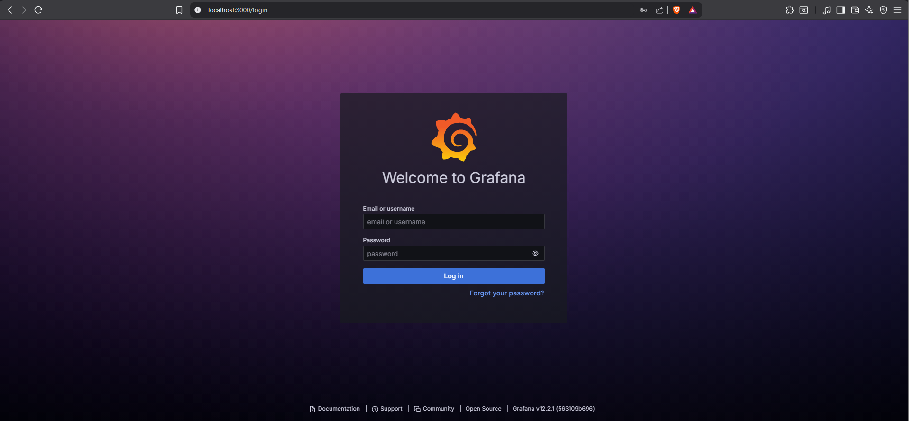
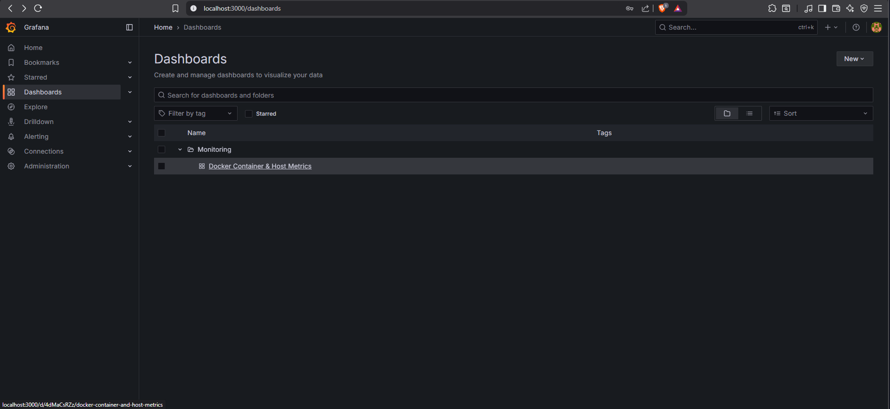
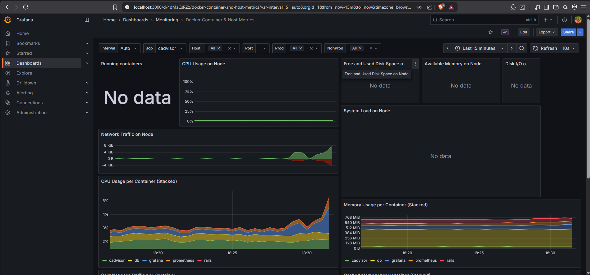
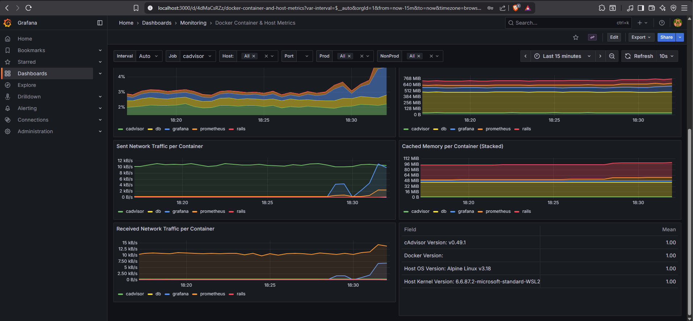

+++
date = '2025-11-02T14:46:38Z'
draft = false
title = "Grafana + Prometheus: Container Monitoring Made Easy"
description = "Learn how to build a complete Docker monitoring stack using Prometheus, Grafana, and cAdvisor — visualize your containers’ performance and gain full observability."
tags = ["grafana", "prometheus", "docker", "monitoring", "observability"]
+++

## Introduction: Why Monitoring Matters

At some point in the development process, every team faces challenges related to performance and availability.
To take the right actions and iterate effectively, we need data — without it, we can’t truly understand the root cause of an issue.

Is a specific service causing downtime?
Where’s the memory leak?
What’s slowing down response times?

This is where monitoring becomes essential.
A solid monitoring setup helps you:

- Identify what happened during incidents or slowdowns.
- Detect performance patterns over time.
- Build alerting systems to take action at the right moment.

Having a centralized place to visualize metrics not only saves time but also empowers teams to react proactively instead of reactively.

---

## Series Overview: What You'll Learn

In this series of posts, you'll learn how to set up a monitoring dashboard using:

- Prometheus → Collects server and container resource metrics.
- Grafana → Visualizes those metrics in powerful, customizable dashboards.
- Docker Compose → Orchestrates everything seamlessly.

By the end of the first post, you’ll have a Grafana dashboard displaying metrics from your Docker containers and a simple Rails To-Do app with its own database.

In the second part, we’ll take it a step further by integrating server logs directly into Grafana.

---

Now that you know what you’ll learn, let’s look at what you’ll actually build and the components that make up your monitoring stack.

---

### Components Overview

- **Prometheus** — collects and stores container metrics.
- **cAdvisor** — exposes per-container CPU, memory, disk, and network statistics.
- **Grafana** — visualizes those metrics, builds dashboards, and creates alerts.
- **MySQL** — serves as the database for our sample app.
- **Rails To-Do App** — demonstrates how to monitor a real running service.

---

### Project Structure

In your working directory (for example, `monitoring_stack/`), create the following structure:

| File / Folder      | Purpose                                                                                                |
| ------------------ | ------------------------------------------------------------------------------------------------------ |
| **.env**           | Holds sensitive credentials for Grafana and MySQL — make sure to keep this **out of version control**. |
| **compose.yml**    | Docker Compose configuration defining all services and how they interact.                              |
| **prometheus.yml** | Prometheus scrape configuration that defines targets (like cAdvisor) to collect metrics from.          |
| **grafana/**       | Contains Grafana provisioning files — such as `datasource.yml` and `dashboard.json`.                   |
| **db_data/**       | Persistent volume for MySQL data (automatically created when containers run).                          |
| **todo_app/**      | Sample Rails application cloned from a public repository to demonstrate app monitoring.                |

---

## Service 1: Prometheus

### What Is Prometheus?

<!-- prettier-ignore -->
> [Prometheus](https://github.com/prometheus) is an open-source systems monitoring and alerting toolkit originally built at [SoundCloud](http://soundcloud.com). Since its inception in 2012, many companies and organizations have adopted Prometheus, and the project has a very active developer and user [community](/community/). It is now a standalone open source project and maintained independently of any company. To emphasize this, and to clarify the project's governance structure, Prometheus joined the [Cloud Native Computing Foundation](https://cncf.io/) in 2016 as the second hosted project, after [Kubernetes](http://kubernetes.io/).  
{cite="https://prometheus.io/docs/introduction/overview/" caption="Prometheus Documentation: Overview"}

---

### How It Works

Prometheus **pulls metrics** from [**exporters**](https://prometheus.io/docs/instrumenting/exporters/) which are servers, containers, or apps that expose data via the `/metrics` endpoint. These metrics are stored in a **time-series database (TSDB)** for queries and alerts.

You can explore data with [**PromQL**](https://prometheus.io/docs/prometheus/latest/querying/basics/), visualize it in **Grafana**, and send **alerts** using Alertmanager.

It tracks metrics such as:

- CPU, memory, and network usage
- HTTP requests and errors
- Database performance
- Custom app metrics

---

### Prometheus in `compose.yml`

Let's create a `compose.yml` file in our working directory and define the **Prometheus service** within it.

```yaml
services:
  # ===========================
  # Prometheus
  # ===========================
  prometheus:
    image: prom/prometheus:latest
    container_name: prometheus
    ports:
      - 9090:9090
    networks:
      - monitoring
    command:
      - --config.file=/etc/prometheus/prometheus.yml
    volumes:
      - ./prometheus.yml:/etc/prometheus/prometheus.yml:ro
    depends_on:
      - cadvisor

# ===========================
# Networks
# ===========================
networks:
  monitoring:
    driver: bridge
```

---

### Configuration Breakdown

| Key / Section             | Description                                                                                                                                                                  |
| ------------------------- | ---------------------------------------------------------------------------------------------------------------------------------------------------------------------------- |
| **image**                 | Pulls the latest official Prometheus image from Docker Hub.                                                                                                                  |
| **container_name**        | Names the container `prometheus` — easier to identify and reference.                                                                                                         |
| **ports**                 | Maps container port `9090` (Prometheus UI) to host port `9090`, accessible at [localhost:9090](http://localhost:9090).                                                       |
| **networks**              | Connects to the `monitoring` network so Prometheus can reach cAdvisor and Grafana.                                                                                           |
| **command**               | Points Prometheus to the main configuration file (`/etc/prometheus/prometheus.yml`).                                                                                         |
| **volumes**               | Mounts the local `prometheus.yml` file as **read-only**, ensuring configuration persistence and security.                                                                    |
| **depends_on**            | Ensures **cAdvisor** starts first, so Prometheus can discover it as a target during startup.                                                                                 |
| **networks → monitoring** | Defines a [**custom bridge network**](https://docs.docker.com/engine/network/drivers/bridge/) for communication between monitoring services (Prometheus, Grafana, cAdvisor). |

---

## Service 2: cAdvisor

### What Is cAdvisor?

<!-- prettier-ignore -->
> [**cAdvisor**](https://github.com/google/cadvisor) (Container Advisor) provides container users an understanding of the resource usage and performance characteristics of their running containers. It is a running daemon that collects, aggregates, processes, and exports information about running containers. Specifically, for each container it keeps resource isolation parameters, historical resource usage, histograms of complete historical resource usage and network statistics. This data is exported by container and machine-wide.
{cite="https://github.com/google/cadvisor" caption="cAdvisor GitHub Repository"}

---

### Why We Need It

Prometheus can only scrape metrics from services that expose a `/metrics` endpoint, but Docker doesn’t provide one by default. That’s where **cAdvisor** comes in. It collects container metrics, exposes them at [**localhost:8080/metrics**](http://localhost:8080/metrics), and allows Prometheus to scrape the data for visualization in Grafana.

---

### cAdvisor in `compose.yml`

In order to add cAdvisor to our monitoring stack, we need to define it in the `compose.yml` file, just below the Prometheus service:

```yaml
services:
  # ===========================
  # Prometheus
  # ===========================

  # ===========================
  # cAdvisor
  # ===========================
  cadvisor:
    image: gcr.io/cadvisor/cadvisor:latest
    container_name: cadvisor
    ports:
      - 8080:8080
    networks:
      - monitoring
    volumes:
      - /:/rootfs:ro
      - /var/run:/var/run:rw
      - /sys:/sys:ro
      - /var/lib/docker/:/var/lib/docker:ro
      - /dev/disk/:/dev/disk:ro
# ===========================
# Networks
# ===========================
```

---

### Configuration Breakdown

| Key / Section       | Description                                                                                                              |
| ------------------- | ------------------------------------------------------------------------------------------------------------------------ |
| **image**           | Pulls the latest official **Google cAdvisor** image from Docker Hub.                                                     |
| **container_name**  | Names the container `cadvisor` - easier to identify and reference.                                                       |
| **ports**           | Maps container port `8080` (cAdvisor UI) to the host port `8080`, accessible at [localhost:8080](http://localhost:8080). |
| **networks**        | Connects to the shared `monitoring` network, allowing Prometheus to scrape its metrics.                                  |
| **volumes**         | Mounts host directories to allow monitoring and Docker visibility:                                                       |
| ├ `/`               | Root filesystem (read-only) — provides full host context.                                                                |
| ├ `/var/run`        | Enables Docker socket communication (read/write).                                                                        |
| ├ `/sys`            | Exposes kernel statistics (read-only).                                                                                   |
| ├ `/var/lib/docker` | Gives access to container metadata for per-container stats.                                                              |
| └ `/dev/disk`       | Provides disk I/O and usage information (read-only).                                                                     |

---

### Adding cAdvisor as a Prometheus Target

In order for Prometheus to start scraping metrics from cAdvisor, we need to add it as a **scrape target** in the `prometheus.yml` file:
Create a `prometheus.yml` file in your project root (next to `compose.yml`) and add the following configuration.

```yaml
# ===========================
# Prometheus Scrape Config
# ===========================
scrape_configs:
  - job_name: cadvisor
    scrape_interval: 5s
    static_configs:
      - targets:
          - cadvisor:8080
```

> [!NOTE]
> In the Prometheus target configuration, `cadvisor:8080` refers to the **service name** and **port** defined in the **Docker Compose** file.
> All services within the same **Docker network** can communicate using their **service names** and **ports** instead of IP addresses.

---

### Configuration Breakdown

| Key / Field         | Description                                                                                |
| ------------------- | ------------------------------------------------------------------------------------------ |
| **job_name**        | Identifies this scrape job. Appears in Prometheus UI and helps organize metrics by source. |
| **scrape_interval** | Defines how often Prometheus scrapes metrics — here, every **5 seconds**.                  |
| **static_configs**  | Manually specifies targets instead of service discovery.                                   |
| **targets**         | List of endpoints exposing metrics. In this case, `cadvisor:8080`                          |

After saving, we can now launch both Prometheus and cAdvisor together:

```bash
docker compose up -d
```

- Access Prometheus → [localhost:9090](http://localhost:9090)
- Access cAdvisor → [localhost:8080](http://localhost:8080)

Prometheus will now start collecting container metrics — ready to be visualized in Grafana.

---

## Service 3: Grafana

Now that **Prometheus** is collecting container metrics via **cAdvisor**, it’s time to **visualize them** — and that’s where **Grafana** comes in.

Grafana provides a **powerful and flexible dashboard interface** that lets us explore metrics in real time.

To make setup easier, we’ll clone a repository that already contains the **Grafana provisioning files** which define:

- The **data source configuration**, so Grafana automatically connects to Prometheus.
- The **default dashboard**, so we can see our container metrics without manually creating panels.

Here’s your text rewritten as a clear, polished **information section** in Markdown style (perfect for tutorials or docs):

> [!NOTE]
> For this tutorial, I imported a **pre-configured Grafana dashboard** that visualizes Docker container metrics collected by Prometheus.
> You can check it out here: [Docker Host & Container Overview Dashboard (ID: 10619)](https://grafana.com/grafana/dashboards/10619-docker-host-container-overview/)

```bash
git clone https://github.com/escorcia21/grafana.git
```

---

### Adding Grafana to the Compose File

Next, we’ll update our `compose.yml` file to include the **Grafana service**.

```yaml
services:
  # ===========================
  # Prometheus
  # ===========================

  # ===========================
  # cAdvisor
  # ===========================

  # ===========================
  # Grafana
  # ===========================
  grafana:
    image: grafana/grafana
    container_name: grafana
    restart: unless-stopped
    environment:
      - GF_SECURITY_ADMIN_USER=${GRAFANA_USER}
      - GF_SECURITY_ADMIN_PASSWORD=${GRAFANA_PASSWORD}
      - GF_USERS_ALLOW_SIGN_UP=false
      - GF_LOG_LEVEL=debug
    ports:
      - 3000:3000
    networks:
      - monitoring
    volumes:
      - grafana_storage:/var/lib/grafana
      - ./grafana/provisioning:/etc/grafana/provisioning:ro
# ===========================
# Networks
# ===========================

# ===========================
# Volumes
# ===========================
volumes:
  grafana_storage: {}
```

---

### Configuration Breakdown

| Key                         | Description                                                                                                                                                |
| --------------------------- | ---------------------------------------------------------------------------------------------------------------------------------------------------------- |
| **image**                   | Uses the official Grafana image from Docker Hub.                                                                                                           |
| **environment**             | Loads admin credentials from the `.env` file and disables new user sign-ups for security.                                                                  |
| **ports**                   | Maps Grafana’s default port (`3000`) so it’s accessible at [localhost:3000](http://localhost:3000).                                                        |
| **volumes**                 | - `grafana_storage` persists dashboards and settings.<br> - `./grafana/provisioning` mounts preconfigured data source & dashboard files in read-only mode. |
| **restart: unless-stopped** | Ensures Grafana restarts automatically unless manually stopped.                                                                                            |
| **networks: monitoring**    | Lets Grafana communicate with Prometheus and cAdvisor containers.                                                                                          |

---

### Setting Up the `.env` File

Before starting the containers, we’ll configure the `.env` file — which stores **sensitive credentials** outside of our main codebase.

Create a file named **`.env`** in your project’s root directory and add:

```bash
GRAFANA_USER=admin
GRAFANA_PASSWORD=supersecret
```

> [!WARNING]
> Feel free to customize these values.
> Remember to **add `.env` to your `.gitignore`** so it doesn’t get pushed to version control.

---

### Launching the Stack

Once everything is ready, bring the stack up with:

```bash
docker compose up -d
```

This will:

- Start **cAdvisor** (collecting container metrics)
- Start **Prometheus** (storing and scraping metrics)
- Start **Grafana** (visualizing them beautifully, using your `.env` credentials)

Then open:
**[localhost:3000](http://localhost:3000)**

Log in using your `.env` credentials and you’ll find Grafana **already connected to Prometheus**, displaying live metrics from your Docker containers



---

#### Viewing Your Metrics

After logging into Grafana:

1. Navigate to **Dashboards → Monitoring → Docker Container & Host Metrics**.
2. This pre-configured dashboard (provisioned automatically) is already connected to Prometheus.



Here you'll find detailed, real-time insights into your containers, such as:

- CPU usage per container
- Memory utilization
- Network traffic





---

## Service 4: MySQL

Now that our monitoring stack is ready, let’s add a **database service** that we’ll later use with our application.
We’ll use **MySQL**, one of the most popular relational databases, and configure it to connect seamlessly with the rest of our containers.

---

### Updating the `.env` File

Let’s expand our `.env` file to include the database credentials.
Add the following lines below your Grafana variables:

```bash
# Grafana credentials
GRAFANA_USER=admin
GRAFANA_PASSWORD=supersecret

# MySQL credentials
DB_USER=root
DB_PASSWORD=supersecret
DB_NAME=todo_app
```

> [!TIP]
> Feel free to adjust these values as needed, especially `DB_PASSWORD`.
> Remember to keep your `.env` file private by adding it to `.gitignore`.

---

### Adding the MySQL Service

Next, let's define the new **MySQL container** inside your `compose.yml` file:

```yaml
services:
  # ===========================
  # Prometheus
  # ===========================

  # ===========================
  # cAdvisor
  # ===========================

  # ===========================
  # Grafana
  # ===========================

  # ===========================
  # MySQL Database
  # ===========================
  db:
    image: mysql
    container_name: db
    restart: always
    volumes:
      - ./db_data:/var/lib/mysql
    environment:
      MYSQL_ROOT_PASSWORD: ${DB_PASSWORD}
    ports:
      - 3306:3306
    networks:
      - monitoring
      - application
    healthcheck:
      test:
        [
          "CMD",
          "mysqladmin",
          "ping",
          "-h",
          "localhost",
          "-u",
          "root",
          "-p${DB_PASSWORD}",
        ]
      interval: 10s
      timeout: 5s
      retries: 5
      start_period: 30s
# ===========================
# Networks
# ===========================

# ===========================
# Volumes
# ===========================
```

### Configuration Breakdown

| **Key**            | **Description**                                                                                                                         |
| ------------------ | --------------------------------------------------------------------------------------------------------------------------------------- |
| **image**          | Uses the official MySQL image from Docker Hub.                                                                                          |
| **container_name** | Names the container `db` for easy reference.                                                                                            |
| **restart**        | Automatically restarts if it stops unexpectedly.                                                                                        |
| **volumes**        | Persists data locally in the `db_data` folder.                                                                                          |
| **environment**    | Loads credentials from the `.env` file.                                                                                                 |
| **ports**          | Exposes MySQL on port `3306`.                                                                                                           |
| **networks**       | Connects this container to both: `monitoring` → visible in the monitoring stack, and `application` → for app-to-database communication. |
| **healthcheck**    | Verifies that MySQL is healthy before other services connect.                                                                           |

---

### Adding the New Network

At the bottom of your `compose.yml`, define an additional network for application traffic:

```yaml
# ===========================
# Networks
# ===========================
networks:
  monitoring:
    driver: bridge
  application:
    driver: bridge
```

This creates a **second bridge network** for your app and database, keeping application traffic.

---

### Spinning Everything Up

Once everything is ready, run:

```bash
docker compose up -d
```

**Now you’ll have:**

- Prometheus gathering metrics
- cAdvisor exposing container data
- Grafana visualizing everything
- MySQL running and waiting for your application

---

## Service 5: Rails App

Now that our database is up, let’s bring in the **application layer** — a simple **Rails “To-Do” app** that connects to MySQL.

---

### Cloning the App

Clone the repository that contains the Rails ToDo app:

```bash
git clone https://github.com/escorcia21/todo_app.git
```

---

### Adding the Rails Service

Now, define the **Rails container** in your `compose.yml`:

```yaml
services:
  # ===========================
  # Prometheus
  # ===========================

  # ===========================
  # cAdvisor
  # ===========================

  # ===========================
  # Grafana
  # ===========================

  # ===========================
  # MySQL Database
  # ===========================

  # ===========================
  # Rails App
  # ===========================
  rails:
    build: ./todo_app
    container_name: rails
    ports:
      - 80:80
    networks:
      - monitoring
      - application
    environment:
      DB_PASSWORD: ${DB_PASSWORD}
      DB_HOST: ${DB_HOST}
      RAILS_ENV: ${RAILS_ENV}
      SECRET_KEY_BASE: ${SECRET_KEY_BASE}
    depends_on:
      db:
        condition: service_healthy
        restart: true
# ===========================
# Networks
# ===========================

# ===========================
# Volumes
# ===========================
```

### Configuration Breakdown

| **Key**            | **Description**                                                                                                  |
| ------------------ | ---------------------------------------------------------------------------------------------------------------- |
| **build**          | Builds the image using the `Dockerfile` in the `todo_app` directory.                                             |
| **container_name** | Names the container `rails`.                                                                                     |
| **ports**          | Maps container port `80` to host port `80` → accessible at [localhost](http://localhost).                        |
| **networks**       | Connects to both:<br>• `application` → for database connection.<br>• `monitoring` → for metric visibility later. |
| **environment**    | Injects variables from the `.env` file.                                                                          |
| **depends_on**     | Waits for MySQL to be healthy before starting the Rails container.                                               |

---

### Updating the `.env` File

Extend your `.env` file to include the Rails variables:

```bash
# Grafana credentials
GRAFANA_USER=admin
GRAFANA_PASSWORD=supersecret

# MySQL credentials
DB_USER=root
DB_PASSWORD=supersecret
DB_NAME=todo_app

# Rails app
DB_HOST=db
RAILS_ENV=development
SECRET_KEY_BASE=$(openssl rand -hex 32)
```

> [!NOTE]
> The `SECRET_KEY_BASE` is used by Rails for encrypting cookies and sessions.
> Generate it using the command above.

---

### Launching Everything

Now you can build and launch the **entire stack**:

```bash
docker compose up -d --build
```

This will:

- Build and start your Rails app
- Start MySQL, Prometheus, cAdvisor, and Grafana
- Connect everything through the proper networks

Open your browser and visit:

**[localhost/todos](http://localhost/todos)**

You should see your **Rails Todo app** running successfully! 🙌

In the grafana dashboard at **[localhost:3000](http://localhost:3000)**, you can now monitor the performance of your Docker containers, including the Rails app and MySQL database.

---

## Architecture Overview

**Congratulations!**
You’ve built a complete **container monitoring and observability stack** using **Docker**, **Prometheus**, **cAdvisor**, **Grafana**, and a sample **Rails app**.

Here’s how everything fits together:

```mermaid
%%{init: {'theme': 'dark'}}%%
architecture-beta
    group monitoring(cloud)[Monitoring]
    group application(cloud)[Application] in monitoring

    service cadvisor(logos:docker-icon)[Metrics Collector] in monitoring
    service prometheus(logos:prometheus)[Metrics Gatherer] in monitoring
    service grafana(logos:grafana)[Dashboard] in monitoring

    service mysql(logos:mysql)[Database] in application
    service rails(logos:ruby)[Backend] in application

    mysql:T -- B:rails

    cadvisor:R --> L:mysql
    cadvisor:B --> L:rails
    cadvisor:B <--> T:prometheus
    cadvisor:L --> T:grafana

    prometheus:L --> R:grafana

```



---

## Going Further with Grafana

Grafana offers powerful ways to **customize your observability**. You can **create custom dashboards** for your system’s metrics or **import community ones**. It also supports **alerting rules** that notify you when metrics exceed defined thresholds, helping you react before issues escalate.

For detailed setup guides on dashboards, alerts, and integrations, check the [official Grafana documentation](https://grafana.com/docs/).

---

## Final Thoughts

With this setup, you now have:

- Full visibility into containers and app performance
- Real-time dashboards with the possibility to create alerts or your own metrics/dashboards
- A scalable, modular observability stack

Feel free to expand this stack by adding more services, exporters, or integrating logging solutions.

This is my first of many posts I will be sharing. Feel free to reach out to me on  if you have any questions or suggestions, and stay tuned for the next post where we’ll integrate logging into Grafana!
