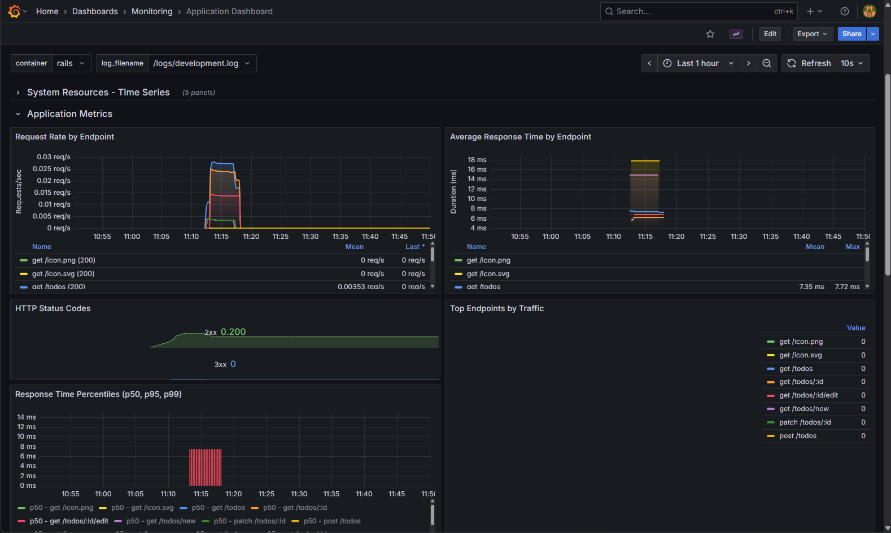
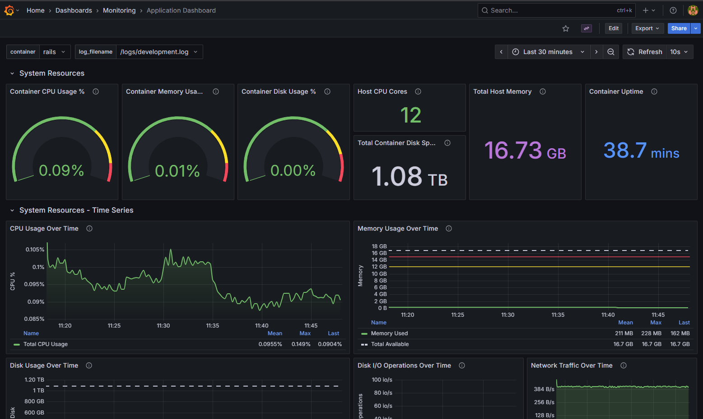
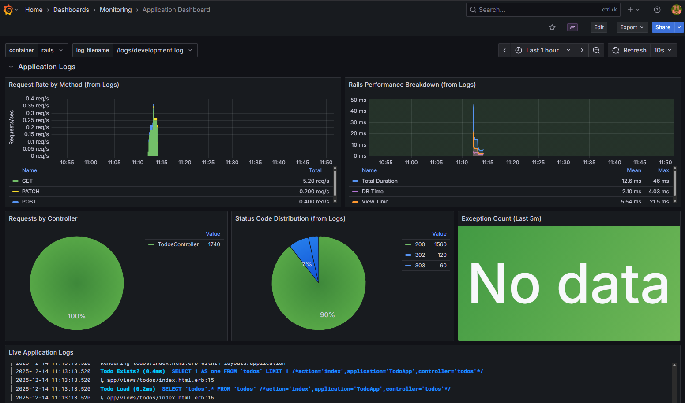

+++
date = '2025-12-14T14:46:38Z'
draft = false
title = "How to Improve API Observability"
description = "Learn how to improve the observability of your API using Prometheus, Grafana, and Alloy. Add application metrics, and structured logs."
tags = ["prometheus", "grafana", "alloy", "loki", "observability"]
+++

## Introduction

Finally! This is the continuation of the [monitoring stack series](../grafana-prometheus-docker-monitoring). In the first part, we focused on **infrastructure metrics**: CPU, memory, and network usage for containers. While that's essential, it only tells part of the story. To truly understand what's happening in your application, you need:

- **Application metrics** — request rates, response times, error rates
- **Structured logs** — searchable, queryable logs in JSON format
- **Complete visibility** — the ability to correlate infrastructure and application data

In this post, we'll enhance our Rails To-Do application with:

- **Prometheus Client** — expose application metrics via a `/metrics` endpoint
- **Lograge** — transform verbose Rails logs into structured JSON
- **Loki** — aggregate and store logs for querying
- **Alloy** — collect and forward logs to Loki
- **Grafana Dashboards** — visualize application metrics, logs, and system resources together

By the end of this article, you'll have a dashboard that combines infrastructure and application metrics:





---

> [!NOTE]
> **Prerequisite:**
> Before continuing, ensure you've completed [part 1](../grafana-prometheus-docker-monitoring) and have the monitoring stack running with Prometheus, Grafana, cAdvisor, MySQL, and the Rails app.

## Instrumenting the Rails Application

To expose application metrics, we'll use the **Prometheus Client** gem, which automatically tracks HTTP requests, response times, and error rates.

Go to the working directory you've set up in the first part, and let's update the ToDo application repository with the latest changes:

```bash
cd todo_app
git pull origin main
```

---

### What Has Changed?

The repository now includes the following:

#### 1. Added Gems to `Gemfile`

```ruby
gem 'prometheus-client'
gem 'lograge'
```

- **`prometheus-client`**: provides Prometheus metrics collection for Ruby applications
- **`lograge`**: transforms verbose Rails logs into structured JSON format

---

#### 2. Configured Prometheus Middleware in `config.ru`

The `config.ru` file now includes Prometheus middleware that automatically collects metrics:

```ruby
require 'rack'
require 'prometheus/middleware/collector'
require 'prometheus/middleware/exporter'

use Rack::Deflater
use Prometheus::Middleware::Collector
use Prometheus::Middleware::Exporter
```

**What this does:**

| Component                           | Description                                                          |
| ----------------------------------- | -------------------------------------------------------------------- |
| `Prometheus::Middleware::Collector` | automatically tracks HTTP requests, response times, and status codes |
| `Prometheus::Middleware::Exporter`  | exposes a `/metrics` endpoint that Prometheus can scrape             |
| `Rack::Deflater`                    | compresses responses for better performance                          |

---

#### 3. Configured Lograge in `config/initializers/lograge.rb`

Lograge transforms verbose Rails logs into clean, structured JSON:

```ruby
Rails.application.configure do
  config.lograge.enabled = true
  config.lograge.formatter = Lograge::Formatters::Json.new

  config.lograge.custom_options = lambda do |event|
    request = event.payload[:request]

    {
      time: Time.now.utc.iso8601(3),
      params: event.payload[:params].except('controller', 'action', 'utf8', '_method', 'authenticity_token', 'password', 'token'),
      ip: request.remote_ip,
      referer: request.referer,
      request_id: request.request_id,
      session_id: (request.session.id rescue nil),
      user_agent: request.user_agent,
      exception: event.payload[:exception],
      exception_object: event.payload[:exception_object]
    }
  end
end
```

With this configuration, the Rails application converts multi-line logs into single-line JSON entries, including useful context like: IP address, user agent, request ID, parameters, making logs easily parseable and searchable.

---

## Adding Rails as a Prometheus Target

Now that our Rails application exposes metrics, we need to tell Prometheus to scrape them. In your `prometheus.yml` file (located in the project root), add the Rails job to the `scrape_configs` section:

```yaml
# ===========================
# Prometheus Scrape Config
# ===========================
scrape_configs:
  - job_name: cadvisor
    scrape_interval: 5s
    static_configs:
      - targets:
          - cadvisor:8080
  - job_name: rails
    scrape_interval: 5s
    static_configs:
      - targets:
          - rails:80
```

---

> [!NOTE]
> In the Prometheus target configuration, `rails:80` refers to the **service name** and **port** defined in the **Docker Compose** file.
> All services within the same **Docker network** can communicate using their **service names** and **ports** instead of IP addresses.

After saving this file, Prometheus will start collecting application metrics from your Rails app.

---

## Service 1: Alloy

### What Is Alloy?

<!-- prettier-ignore -->
> [**Alloy**](https://grafana.com/docs/alloy/latest/introduction/) Alloy is a flexible, high performance, vendor-neutral distribution of the [OpenTelemetry](https://opentelemetry.io/docs/what-is-opentelemetry/) Collector. It’s fully compatible with the most popular open source observability standards such as OpenTelemetry and Prometheus.
{cite="https://grafana.com/docs/alloy/latest/introduction/" caption="Grafana Alloy Documentation"}

---

### Creating the Alloy Configuration

In the same working directory you used in the previous tutorial, create a new file called `config.alloy` with the following content:

```js
livedebugging {
  enabled = true
}

local.file_match "local_files" {
    path_targets = [{"__path__" = "/logs/*.log", "job" = "rails", "hostname" = constants.hostname}]
    sync_period  = "5s"
}

loki.source.file "log_scrape" {
    targets    = local.file_match.local_files.targets
    forward_to = [loki.write.local.receiver]
    tail_from_end = true
}

loki.write "local" {
  endpoint {
    url = "http://loki:3100/loki/api/v1/push"
  }
}
```

---

### Configuration Breakdown

| Key / Component      | Description                                                                              |
| -------------------- | ---------------------------------------------------------------------------------------- |
| **livedebugging**    | Enables live debugging interface for troubleshooting (accessible on port 12345).         |
| **local.file_match** | Discovers log files matching the pattern `/logs/*.log` and labels them with `job=rails`. |
| **sync_period**      | How often Alloy checks for new log files — here, every **5 seconds**.                    |
| **loki.source.file** | Reads log files from the discovered targets and tails them from the end.                 |
| **tail_from_end**    | Starts reading from the end of the file (useful for existing logs).                      |
| **loki.write**       | Forwards collected logs to Loki at `http://loki:3100/loki/api/v1/push`.                  |

This configuration will make Alloy tail the Rails logs and send them to Loki for storage and querying.

---

## Service 2: Loki

### What Is Loki?

<!-- prettier-ignore -->
> [**Loki**](https://grafana.com/docs/loki/latest/get-started/) Loki is a horizontally scalable, highly available, multi-tenant log aggregation system inspired by Prometheus. It’s designed to be very cost-effective and easy to operate. It doesn’t index the contents of the logs, but rather a set of labels for each log stream.
{cite="https://grafana.com/docs/loki/latest/get-started/" caption="Grafana Loki Documentation"}

---

### Creating the Loki Configuration

In the same working directory, create a new file called `loki-config.yaml` with the following content, more info [here](https://grafana.com/docs/loki/latest/configure/examples/configuration-examples/#1-local-configuration-exampleyaml):

```yaml
auth_enabled: false

limits_config:
  allow_structured_metadata: true
  volume_enabled: true

server:
  http_listen_port: 3100

common:
  ring:
    instance_addr: 0.0.0.0
    kvstore:
      store: inmemory
  replication_factor: 1
  path_prefix: /tmp/loki

schema_config:
  configs:
    - from: 2020-05-15
      store: tsdb
      object_store: filesystem
      schema: v14
      index:
        prefix: index_
        period: 24h

storage_config:
  tsdb_shipper:
    active_index_directory: /tmp/loki/index
    cache_location: /tmp/loki/index_cache
  filesystem:
    directory: /tmp/loki/chunks

pattern_ingester:
  enabled: true

ingester:
  max_chunk_age: 5m
```

---

### Configuration Breakdown

| Key / Section      | Description                                                          |
| ------------------ | -------------------------------------------------------------------- |
| **auth_enabled**   | Disables authentication (suitable for local development).            |
| **server**         | Configures Loki to listen on port `3100` for HTTP requests.          |
| **schema_config**  | Defines the storage schema using TSDB (Time Series Database) format. |
| **storage_config** | Configures filesystem storage for log chunks and index files.        |

---

## Updating Docker Compose

Now we'll add the new services (Loki and Alloy) to our `compose.yml` file and update the Rails service to share its logs directory, and make it accessible to Alloy.

### Adding Alloy Service

Add the Alloy service to your `compose.yml` file:

```yaml
services:
  # ===========================
  # Prometheus
  # ===========================

  # ===========================
  # cAdvisor
  # ===========================

  # ===========================
  # Grafana
  # ===========================

  # ===========================
  # MySQL Database
  # ===========================

  # ===========================
  # Alloy
  # ===========================
  alloy:
    image: grafana/alloy:latest
    container_name: alloy
    ports:
      - 12345:12345
    networks:
      - monitoring
      - application
    volumes:
      - ./config.alloy:/etc/alloy/config.alloy
      - rails_logs:/logs
    command: run --server.http.listen-addr=0.0.0.0:12345 --storage.path=/var/lib/alloy/data /etc/alloy/config.alloy
    depends_on:
      - loki
```

---

### Configuration Breakdown: Alloy

| Key / Section      | Description                                                                           |
| ------------------ | ------------------------------------------------------------------------------------- |
| **image**          | Uses the official Grafana Alloy image from Docker Hub.                                |
| **container_name** | Names the container `alloy` for easy reference.                                       |
| **ports**          | Exposes port `12345` for the live debugging interface.                                |
| **networks**       | Connects to both `monitoring` and `application` networks for log collection.          |
| **volumes**        | Mounts the Alloy config file and the shared `rails_logs` volume to access Rails logs. |
| **command**        | Runs Alloy with the config file.                                                      |
| **depends_on**     | Ensures Loki starts before Alloy.                                                     |

---

### Adding Loki Service

Add the Loki service to your `compose.yml` file:

```yaml
# ===========================
# Loki
# ===========================
loki:
  image: grafana/loki:latest
  container_name: loki
  ports:
    - 3100:3100
  networks:
    - monitoring
    - application
  volumes:
    - ./loki-config.yaml:/etc/loki/local-config.yaml
  command:
    - -config.file=/etc/loki/local-config.yaml
```

---

### Configuration Breakdown: Loki

| Key / Section      | Description                                                    |
| ------------------ | -------------------------------------------------------------- |
| **image**          | Uses the official Grafana Loki image from Docker Hub.          |
| **container_name** | Names the container `loki` for easy reference.                 |
| **ports**          | Exposes port `3100` for the Loki API (where Alloy sends logs). |
| **networks**       | Connects to both `monitoring` and `application` networks.      |
| **volumes**        | Mounts the Loki configuration file.                            |
| **command**        | Points Loki to the configuration file location.                |

---

### Updating Rails Service

Update the Rails service to mount the logs directory so Alloy can access it:

```yaml
# ===========================
# Rails App
# ===========================
rails:
  build: ./todo_app
  container_name: rails
  ports:
    - 80:80
  networks:
    - monitoring
    - application
  environment:
    DB_PASSWORD: ${DB_PASSWORD}
    DB_HOST: ${DB_HOST}
    RAILS_ENV: ${RAILS_ENV}
    SECRET_KEY_BASE: ${SECRET_KEY_BASE}
  volumes:
    - rails_logs:/rails/log
  depends_on:
    alloy:
      condition: service_started
    db:
      condition: service_healthy
      restart: true
```

---

### Configuration Breakdown: Rails Updates

| Key / Section  | Description                                                                     |
| -------------- | ------------------------------------------------------------------------------- |
| **volumes**    | Mounts the `rails_logs` volume to `/rails/log` so logs are accessible to Alloy. |
| **depends_on** | Ensures Alloy starts before Rails.                                              |

---

### Adding the Shared Volume

Make sure to add the `rails_logs` volume to your volumes section:

```yaml
# ===========================
# Volumes
# ===========================
volumes:
  prometheus_data: {}
  grafana_storage: {}
  mysql_data: {}
  rails_logs: {}
```

The `rails_logs` volume is shared between the Rails container (which writes logs) and the Alloy container (which reads them).

---

## Updating the Grafana Repository

The Grafana repository has been updated with a new dashboard and Loki datasource configuration. Update it with the latest changes:

```bash
cd grafana
git pull origin main
```

---

### What Has Changed?

The repository now includes:

1. **`rails_container.json`**, A pre-configured Grafana dashboard that visualizes:
   - Application metrics (request rates, response times, error rates)
   - System resources (CPU, memory, network) for the Rails container
   - Log metrics and log queries

2. **Loki datasource configuration** was added in the `provisioning/datasources` directory, which automatically configures Grafana to connect to Loki.

---

### Launching the Complete Stack

Now you can launch the entire observability stack:

```bash
docker compose up -d --build
```

This will:

- Start **Prometheus** (collecting infrastructure and application metrics)
- Start **cAdvisor** (exposing container metrics)
- Start **Grafana** (visualizing everything)
- Start **Loki** (storing logs)
- Start **Alloy** (collecting and forwarding logs)
- Start **MySQL** (database)
- Start **Rails** (application with metrics and structured logs)

---

### Viewing Your Dashboard

After all services are running:

1. Open **[localhost:3000](http://localhost:3000)** and log in with your Grafana credentials
2. Navigate to **Dashboards → Monitoring → Application Dashboard**
3. You'll see a dashboard combining:
   - **System resources** : CPU, memory, network usage for the Rails container
   - **Application metrics** : HTTP request rates, response times, status codes
   - **Application logs** : Log streams and log metrics

---

## Conclusion

Visualizing system metrics is important, but combining them with application metrics is crucial to understand how your apps/services perform. This dashboard can give you a different perspective and help you identify bottlenecks and issues faster.

This completes our two-part series on building a complete monitoring and observability stack. If you have any questions or suggestions, feel free to reach out to me on !
